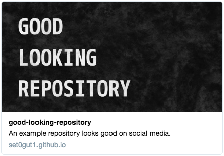
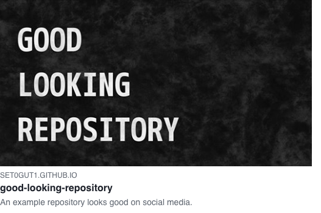

# good-looking-repository

This is an experiment how to improve the apearance of GitHub repoository on social media, like Twitter, Facebook and LinkedIn.

Website: [https://set0gut1.github.io/good-looking-repository/](https://set0gut1.github.io/good-looking-repository/)

## Comparison before and after improvement

| media | repository itself | GitHub Page |
| ---- | ---- | ---- |
| Twitter |  |  |
| Facebook |  |  |
| LinkedIn |  |  |

## Problems at sharing a GitHub repository on social media

Even if you want to display the application's logo when social media sharing, your account profile image (often is a face picture) is used as og:image.
Your face is also stretched in LinkedIn. This is not good looking.

A message is appended on twitter: "Contribute to &lt;repository-name&gt; development by creating an account on GitHub".
I think this message is nice, but may not suitable on situation such that portrait list.

## How to improve the appearance of social media

The solution is to create an application website using the appropriate ogp tag and use it for sharing on social media.
This is easy with the GitHub Pages.

Required steps:

1. create some markdown file for website, or reuse README.md
2. create a logo image (height: 630 / width: 1200 seems to be the best)
3. create \_config.yml for jekyll configuration
4. publish these with GitHub Pages
5. finally, use the url of GitHub Page for sharing on social media.

The contents of \_config.yml are like this.

```yaml
theme: jekyll-theme-cayman
twitter:
  username: set0gut1
defaults:
  - scope:
      path: ""
    values:
      image:
        path: /img/logo.jpg
        height: 630
        width: 1200
```

## Link to related information

- Checking tools for the appearance on social media
    - [Twitter card validator](https://cards-dev.twitter.com/validator/)
    - [Facebook share debugger](https://developers.facebook.com/tools/debug/)
- Other options of \_config.yml for meta tag
    - [About Jekyll SEO Tag](https://github.com/jekyll/jekyll-seo-tag/tree/master/docs)
- Issue on github: [Support custom (per repository) og:image thumbnails.](https://github.com/isaacs/github/issues/612)
